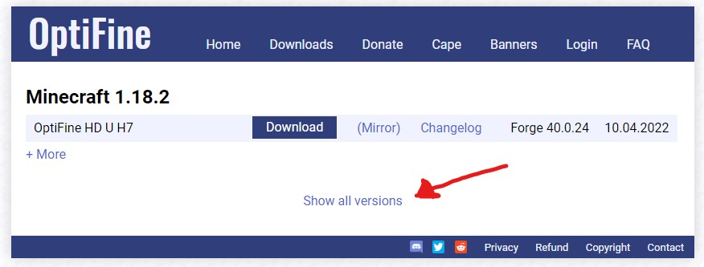
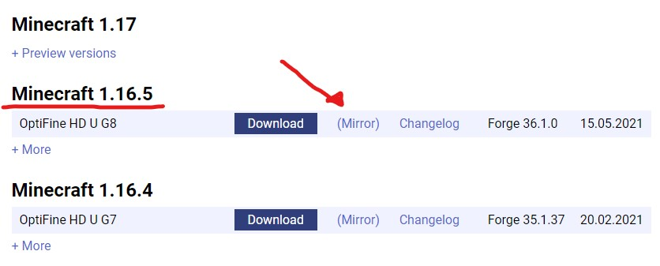
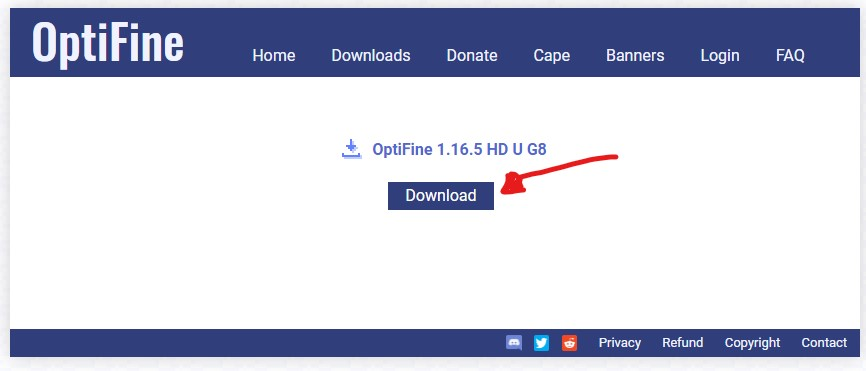
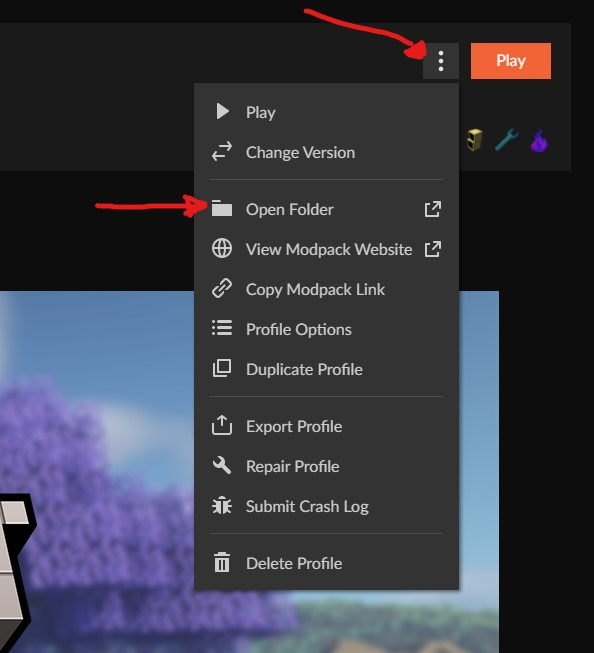
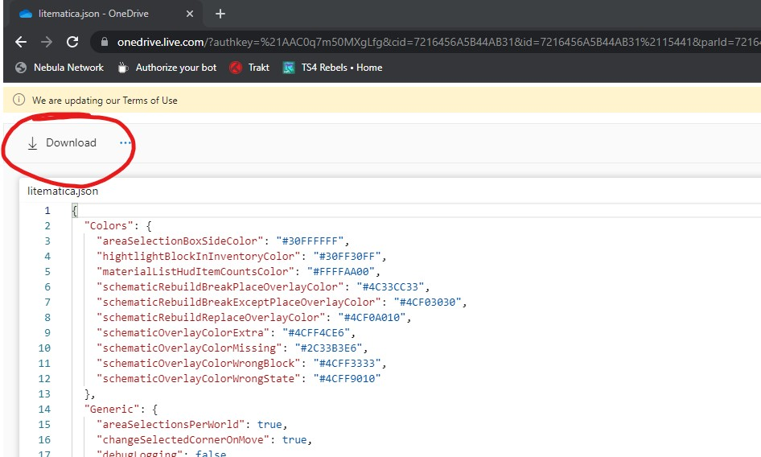
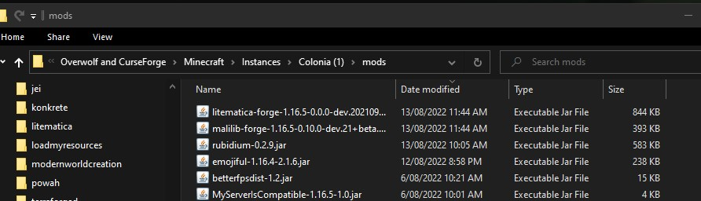
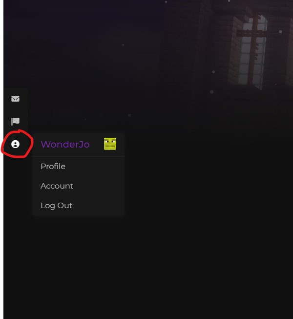
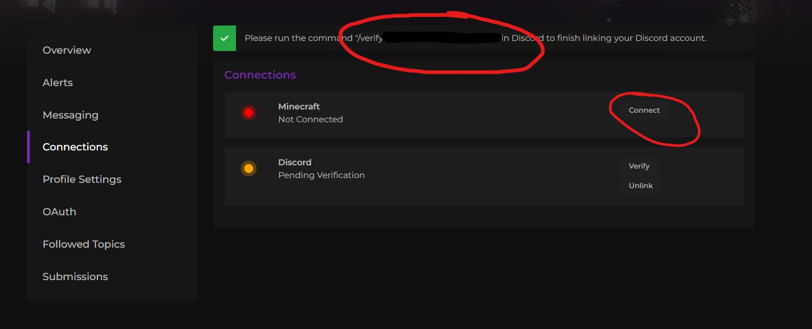

FAQ
===

## How do I install Optifine?

We strongly recommend you don't use optifine with our mod packs, as it conflicts with some of our mods, and blocks such as chests may appear invisible. However, If you'd still like to install it, you can follow the steps below. 

## What is optifine?

Optifine is a Minecraft optimization mod, which can help your computer to run Minecraft more efficiently by increasing the frame rate and improving graphics, with full support for HD textures and many options for configuration. 

Optifine allows for better control of in-game graphics and provides the usage of shaders.

### Installation

Optifine does not allow for reuploads of its mod and curse forge will deny it almost instantly if attempted to include it in a mod pack, so you are required to install it yourself. It is important that you follow these steps exactly to ensure that it is being installed properly and will work.

### Step 1: 

Head over to https://optifine.net/downloads and click ‘Show all versions’

### Step 2:

Scroll down until you find Minecraft 1.16.5, 

On Optifine HD U G8, click (Mirror)

It is VERY IMPORTANT that you download that exact version.

### Step 3:

Click Download. Wait until the jar file finishes downloading.

### Step 4:

Open Colonia on your Curseforge launcher. 

Next to the ‘Play’ Button, click the 3 dots next to it.

Select ‘Open Folder’ from the selections. 

### Step 5:

In a different window, find your downloads folder.

Drag your ‘Optifine.1.16.5_HD_U_G8.jar’ file into the Colonia ‘mods’ folder. 

### Step 6:

Optifine should now be in your mods folder.

Congratulations! You installed Optifine. You should not have any issues running it but if you do, make sure to contact a staff member on our discord.

## Where can I build?

Theoretically, you can build in any world, but please be aware that any dimension (except the overworld) can be reset at any time. 

We do give a few days' warnings before doing this to allow players to retrieve any property. Please view the ‘How big is the world' section for more information on this

## What is the server IP?

It is included in the mod pack, but if missing, the address is mc.nebulanetwork.net.

## Where can I apply for staff?

tba

## My golden shovel/stick isn't working!

You may need to type the /claimtool command for them to activate. You can also use /claim and use your free hand

## How big is the world?

The center of each dimension is at x 0 and z 0 coordinates. Below are the sizes of each of the dimensions on the official server. If a world has a border of 5000 blocks, it means that the border is 2500 blocks from the center. totaling to a 5000x5000 block area.  If a If a world reset is to happen, the server is required to go into maintenance until the entire world generates. We will give a few days warning before this happens. 

|  Dimension | Border Size |         Can be reset?        |
|:----------:|:-----------:|:----------------------------:|
| Overworld  | 10k         | No.                          |
| Nether     | 5k          | Yes                          |
| End        | 10k         | Yes                          |
| Alheim     | 5k          | Only if absolutely required. |
| Mining     | 5k          | Yes                          |
| Everbright | 5k          | Only if absolutely required. |
| Everdawn   | 5k          | Only if absolutely required. |

## How to install & use litematica

The main feature of litematica is to display a "hologram" version of a schematic, which shows you exactly how to build the structure and where to place the blocks. It also includes a (configurable) overlay to highlight missing, extra, or wrongly placed blocks.

Litematica is a client-side mod that you can use on our Colonia server to help you with builds. 

### Downloads

Head over to this website and download the two following jar files. Make sure you download these two exact versions otherwise you will not be able to join the server. 

litematica-forge-1.16.5-0.0.0-dev.20210917.jar
malilib-forge-1.16.5-0.10.0-dev.21+beta.1.jar

You also need to download this config file, as the default conflicts with GriefDefender. The password is Colonia

### Install

Once you have downloaded the three files, it's time to install them.

### Step 1:

Head over to your mod pack directory. You can access it here

### Step 2:

Place your litematica and malilib jar files into your ‘mods’ folder.  It should look like this. 

Place your litematica.json file in your config folder. If you've already launched the mod pack with litematica installed, it will already have a litematica.json file. Replace it with this one. 

### Using litematica

I recommend you watch this video to understand how to use litematica. Please be aware that due to GriefDefender conflicts, I had to swap the tool from a stick to a golden axe. Enjoy!

https://www.youtube.com/watch?v=KFzyNtyN8qI

### How do I protect my base?

You can use GriefDefender to claim your area, which is similar to grief prevention. Please see our Grief Defender page for more information. 

Please do not rely on MineColonies claims, as they may be disabled in the future. 

### How do I whitelist a mod or texture pack?

You can request a mod or texture pack to be whitelisted by visiting our forum.

### How do i disable/edit my HUD?

Press ‘o’ and disable or change options. 

### I can't use Mystical Fertilizer!

Due to the right-click harvest feature that Pam's HarvestCraft adds, any ‘block’ interaction with plants is disabled (except vanilla fertilizer). You can still use modded fertilizer if you put them in your off-hand. 

## How do I link my minecraft & discord accounts to the website?

### Step 1:

On the left side of the page, hover over the account menu and select ‘Account’ 

### Step 2:

In your account settings, select ‘connections’

### Step 3:

Click ‘connect’ on minecraft and/or discord. A verification command should show up. Run this either in minecraft or discord (bot channel on Nebula Network) and you're done.

