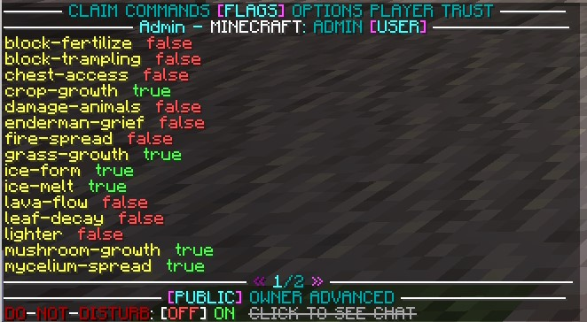

Grief Defender
==============

[Grief Defender](https://www.spigotmc.org/resources/1-12-2-1-19-1-griefdefender-claim-plugin-grief-prevention-protection.68900/) is a highly customizable, all-in-one anti-grief plugin that supports Hybrid Servers, which we are using. 

This page aims to help the player to use grief defender to effectively protect their claim and use some of the flag functionality. Please visit the [official wiki website](https://github.com/bloodmc/GriefDefender/wiki) for grief defender if you need more information. 

You can install [WorldEdit CUI](https://www.curseforge.com/minecraft/mc-mods/worldeditcui-forge-edition-3) for better visuals. 

## Getting Started

To get started, the player can claim a golden shovel using the /kit command. This kit is available every 24 hours.

You can also use the /claim command to claim a land using their free hand.

Begin by selecting one of the corners of your claim. Ensure that you have enough claim blocks to cover your entire area. Once confirmed, head over to the opposite corner of the claim to create a shape. You should now see a shape with golden blocks in each corner.

## Next Steps

As mentioned, some parts of the plugin are not functioning properly, this is most likely a conflict with forge or the server software we are using.

It is recommended to not use the inventory GUI, but instead the chat GUI. You can switch between them using /claimgui.

Some of the commands don't work well either, one bug I found was trying to set a flag and it said I don't have the proper permission. It worked fine when using the chat GUI

You can use the /trust command to allow your friends access your claim. 

For easier navigation, we recommend only using the /gd command. You can switch through claims info and lists, see who's trusted, flags set in the current claim, etc. 

## Flags

You can edit flags by using the /gd command and selecting ‘flags’, while standing inside of your claim. 

  

and you can switch them between true and false by clicking on them, it also gives you more information when hovering over them. 

## Bugs

The following are some of the bugs I have encountered.

Can't switch claim back to a regular claim after setting it to Town
Using flag commands displays that I don't have access to it, even though I am OP and have all permissions.